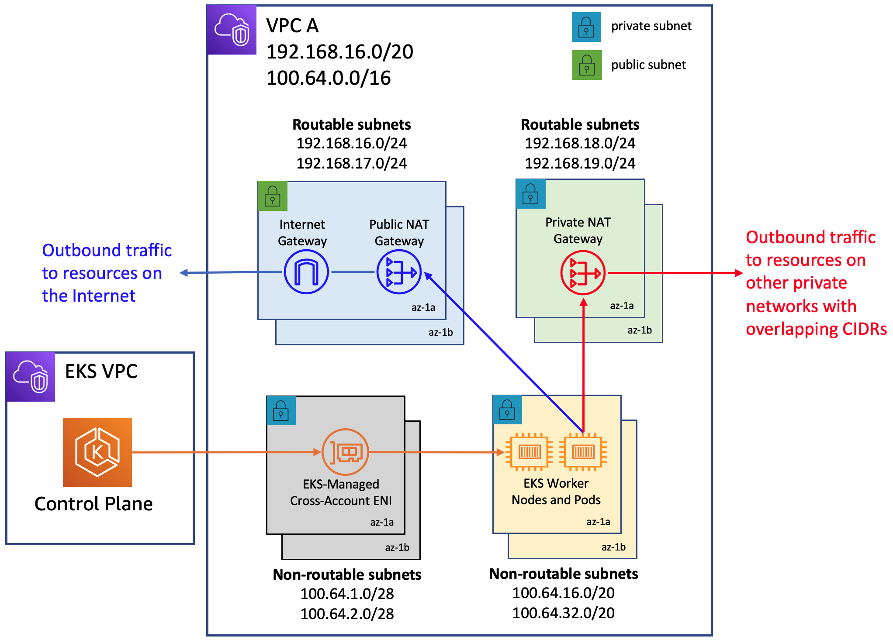
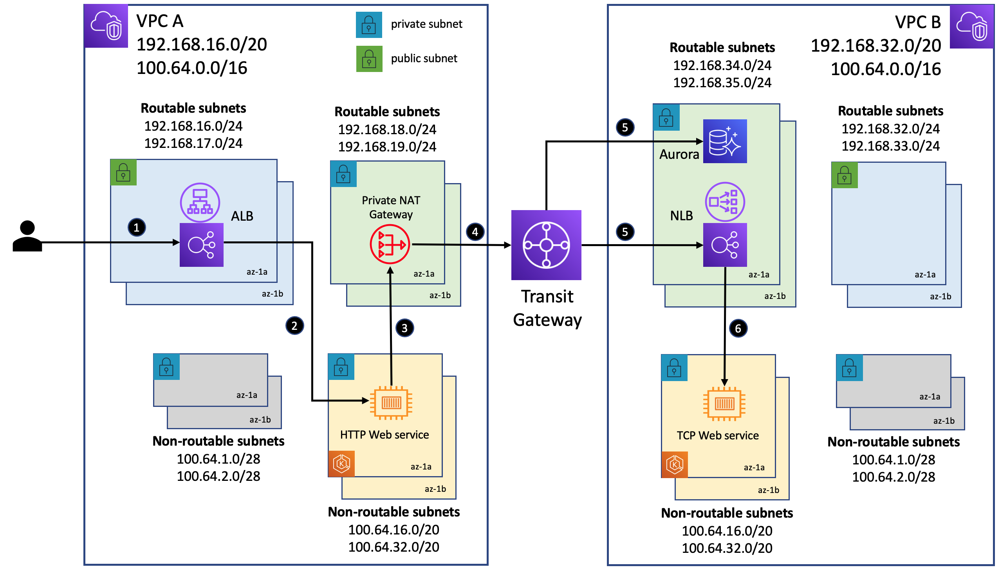

## Addressing IPv4 address Exhaustion in Amazon EKS Clusters using private NAT gateways

This repository contains software artifacts for implementing the networking architecture discussed in this [blog](https://aws.amazon.com/blogs/containers/addressing-ipv4-address-exhaustion-in-amazon-eks-clusters-using-private-nat-gateways/) to deploy Amazon EKS clusters into VPCs wth overlapping CIDRs. It demonstrates a use case where workloads deployed in an EKS cluster provisioned in a VPC are made to communicate, using a private NAT gateway, with workloads deployed to another EKS cluster in a different VPC with overlapping CIDR ranges. 

### Network architecture

### Solution architecture

### Deployment Instructions

#### Setting up the network architecture
1. Execute the script **vpc-a.sh** to setup a VPC named **EKS-VPC-A** with the routable CIDR 192.168.16.0/20 and non-routable CIDR 100.64.0.0/16
2. Execute the script **vpc-b.sh** to setup a VPC named **EKS-VPC-B** with the routable CIDR 192.168.32.0/20 and non-routable CIDR 100.64.0.0/16
3. Execute the script **tgw.sh** to setup a transit gateway and transit gateway attachments in order to route traffic between the two VPCs. This script will also update the route tables associated with the transit gateway as well as the routable subnets in the two VPCs.

#### Setting up the PostgreSQL database 
4. Execute the script **postgres-setup/setup.sh** to setup an Aurora PostgreSQL database instance in **EKS-VPC-B**
5. Follow the instructions in the file [postgres/initialize.md](https://github.com/aws-samples/eks-private-nat-gateway/blob/main/postgres-setup/initialize.md) to initialize this database instance with tables and import sample data into it. The commands in this script should be executed from an EC2 instance that was launched in **EKS-VPC-B** in order to have access to the private endpoint of the database.
 
#### Setting up the EKS clusters 
6. Execute the script **cluster-a.sh** to launch an EKS cluster named **EKS-CLUSTER-A** into **EKS-VPC-A** and provision a managed node group.
7. Execute the script **cluster-b.sh** to launch an EKS cluster named **EKS-CLUSTER-B** into **EKS-VPC-B** and provision a managed node group.
8. Run the *aws eks update-kubeconfig --name $CLUSTER_NAME --region $REGION* command to update the Kubernetes configuration file and enable *kubectl* 
access to both clusters.

#### Deploying workloads to the EKS clusters 
9. Execute the script **createIRSA.sh** to set IAM roles and service accounts required to deploy the AWS Load Balancer Controller to both clusters.
10. Set Kubernetes context to **EKS-CLUSTER-B** using the *kubectl config use-context* command and then execute the script **kubernetes-deploy-b.sh**. This will deploy the TCP web service and the AWS Load Balancer controller to the cluster. The latter will provision an internal Network Load Balancer fronting the web service.
11. Update the script **kubernetes-deploy-a.sh** by modifying the variable **POSTGRES_HOST** that is used in a Kubernetes Secret creation with the endpoint URL of the database instance setup in Step 4. Next, update the YAML manifest **deployment-http-service.yaml** by modifying the environment variable **TIME_SERVICE_HOST** with the DNS name of the Network Load Balancer created in Step 10. 
12. Set Kubernetes context to **EKS-CLUSTER-A** and then execute the script **kubernetes-deploy-a.sh**. This will deploy the HTTP web service and the AWS Load Balancer controller to the cluster. The latter will provision an internet-facing Application Load Balancer fronting the web service.
13. Now, you can invoke the HTTP web service endpoints using the DNS name of the Application Load Balancer as follows:
  - curl -X GET http://$ALB_DNS_NAME/data
  - curl -X GET http://$ALB_DNS_NAME/time

#### Cleanup
Please use the following scripts to cleanup the resources provisioned above.
- Delete Aurora PostgreSQL database instance and the database subnet group using [postgres/cleanup.sh](https://github.com/aws-samples/eks-private-nat-gateway/blob/main/postgres-setup/setup.sh)
- Delete the transit gateway using [cleanup-tgw.sh](https://github.com/aws-samples/eks-private-nat-gateway/blob/main/cleanup-tgw.sh)
- Delete the EKS clusters using [cleanup-cluster.sh](https://github.com/aws-samples/eks-private-nat-gateway/blob/main/cleanup-cluster.sh)
- Delete the VPCs using [cleanup-vpc.sh](https://github.com/aws-samples/eks-private-nat-gateway/blob/main/cleanup-vpc.sh)

## Security

See [CONTRIBUTING](CONTRIBUTING.md#security-issue-notifications) for more information.

## License

This library is licensed under the MIT-0 License. See the LICENSE file.

